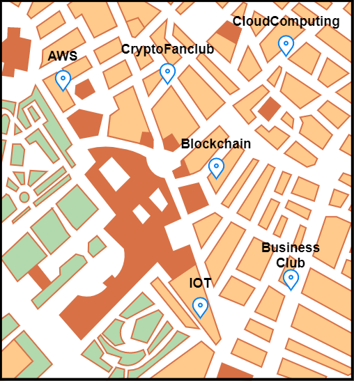
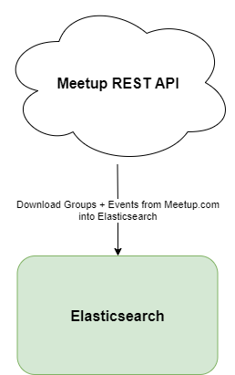
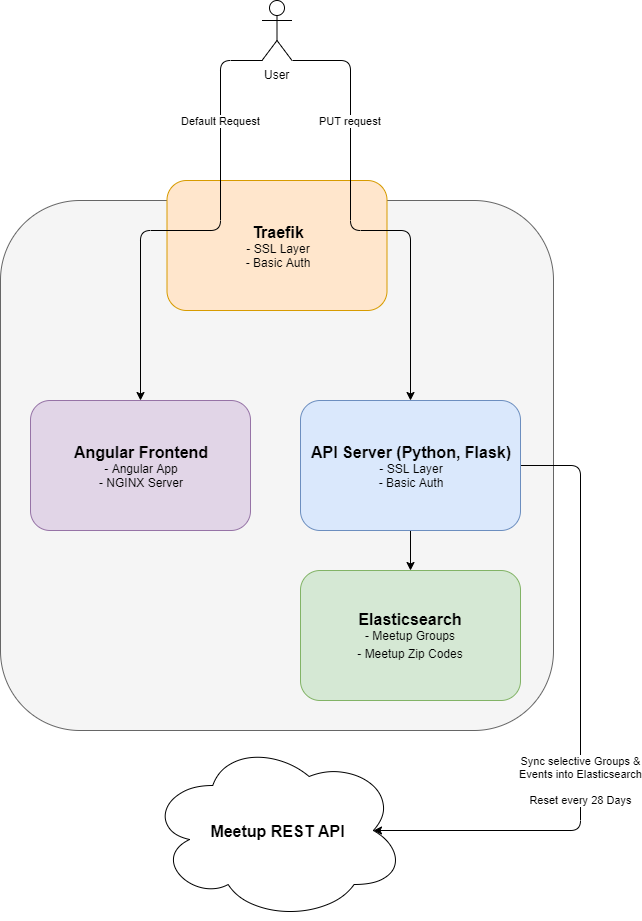

.. Flask Meetup Data Scraper documentation master file, created by
   sphinx-quickstart.
   You can adapt this file completely to your liking, but it should at least
   contain the root `toctree` directive.

Flask Meetup Data Scraper Project Documentation
====================================================================

Fulltext Meetup.com Search engine, download & index every meetup Group and the Group Events in a region every 28 days.

With the fulltext meetup search is it possible to search in every discription and any other field. So you know
in wich places you done a talk.

    Problem: In wich meetups did my team a talk?

Because it is not possible to create a fulltext search request on the official meetup API, so 
a way to solve the issue is to download relevant meetup groups and index them into a elasticsearch.

    Solution: Download every relevant group from meetup and index them into elasticsearch!

The Dataflow concept is that the API Server, wich is written in Python with the 
`Flask webframework <https://palletsprojects.com/p/flask/>`_, download every 28 days all relevant meetup
groups with there events and index them into elasticsearch. The search user use an angular app to communicate 
with the API server. For an easy deployment the angular app has it's own ``NGINX`` based docker container and
the ``traefik`` container route every ``http`` & ``https`` traffik to the angular container expect ``PUT`` request.
``Put`` request are routet to the API server. Also ``traefik`` secure the communication with the enduser via SSL
and used to handle basic auth request for the frontend & backend!

    DataFlow

Table of Contents:

.. toctree::
   :maxdepth: 2

   getting_started
   usage-guide
   advanced_topics
   ide
   rest_api
   ci
   elasticsearch_query
   frontend
   troubleshooting
   faq

Indices & Tables
================

* :ref:`genindex`
* :ref:`modindex`
* :ref:`search`
