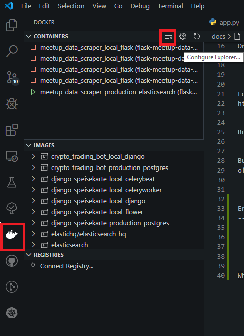

Troubleshooting
=====================================

This page contains some advice about errors and problems commonly encountered during the development
of Meetup Data Scraper.

max virtual memory areas vm.max_map_count [65530] likely too low, increase to at least [262144]
-----------------------------------------------------------------------------------------------

When using docker on some machines, you will need to manually extend the max virtual memory. For
CentOS & Ubuntu use::

    $ sudo sysctl -w vm.max_map_count=262144

Or add it permanently use::

    $ echo "vm.max_map_count=262144" | sudo tee -a /etc/sysctl.conf
    $ sudo reboot

For more detils go to ->
https://www.elastic.co/guide/en/elasticsearch/reference/current/vm-max-map-count.html

Build faild -> out of memory
----------------------------

Building need quit a lot of RAM, if container like elasticsearch run in background you can ran out
of memory. So you need to stop all all containers.::

    $ docker-compose -f production.yml stop

Error when starting container under Windows
-------------------------------------------

    ``ERROR``: for flask-meetup-data-scraper_flask_1  Cannot start service flask: error while
    creating mount source path ``/host_mnt/c/Users/.../dev/flask-meetup-data-scraper``: 
    ``mkdir /host_mnt/c: file exists``

When the error comes, in most cases is it enought to just delete all unused container.

    Delte unused docker containers