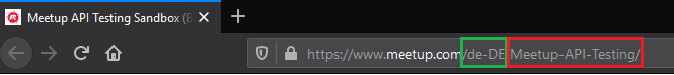

.. Color codes for this document

.. raw:: html

    

.. role:: red

.. raw:: html

    
    
.. role:: green

Usage Guide
=====================================

.. note::
   The usage guide is written for the development instance, to use the commands for prodcution
   change ``-f local.yml`` to ``-f production.yml`` for every command!

CLI
---

Help
^^^^

.. index:: help

For showing a general help for all commands run:

.. code-block:: console

    $ docker-compose -f local.yml run flask flask

To display a helptext for a single command, add to the command ``--help`` like:

.. code-block:: console

    $ docker-compose -f local.yml run flask flask shell --help

migrate_models
^^^^^^^^^^^^^^

To use elasticsearch search, the index for the ``groups`` & ``zip codes`` musst be set. To do this
run: 

.. code-block:: console

  $ docker-compose -f local.yml run flask flask migrate_models

Load single group from Meetup.com
^^^^^^^^^^^^^^^^^^^^^^^^^^^^^^^^^

.. index:: urlname

To download a single group from Meetup.com and index them into elasticsearch use ``get_group``. For
downloading a group use the ``urlname``. When you are on a Meetup group page like
https://www.meetup.com/de-DE/Meetup-API-Testing/, the :red:`urlname`
is in the browser URL field after the :green:`language-code` block.

In the example for `Meetup-API-Testing <https://www.meetup.com/de-DE/Meetup-API-Testing/>`_ group,
the :green:`language-code` is :green:`de-DE` and the :red:`urlname` is :red:`Meetup-API-Testing`.

    Meetup group urlname screenshot

Also when you search for new groups in the `meetup.com rest api
<https://www.meetup.com/meetup_api/>`_, the ``urlname`` has it extra field for request a group
entpoint.

So to download & index the `Meetup-API-Testing <https://www.meetup.com/de-DE/Meetup-API-Testing/>`_
group use:

.. code-block:: console

    $ docker-compose -f local.yml run flask flask get_group Meetup-API-Testing

The output should look like:

.. code-block:: console

    Starting flask-meetup-data-scraper_elasticsearch_1 ... done
    Elasticsearch is available
    Group Meetup API Testing Sandbox was updatet with 761 events

For testing purpose it's possible to load the sandbox group with the param ``--sandbox True``, than
it's not required to add a ``urlname``.:

.. code-block:: console

    $ docker-compose -f local.yml run flask flask get_group --sandbox True

get_groups
^^^^^^^^^^ 

.. warning::
   The command ``get_groups`` is desiged for use only in development, for prodcution please use
   ``load_groups``!

Load mutiple groups from JSON files. The JSON files muss include a key & a URL name. To download use
the rest api direkt or via the meetup website
https://secure.meetup.com/meetup_api/console/?path=/find/groups 

An example Rest API request for the first 200 german groups ->
https://api.meetup.com/find/groups?&sign=true&photo-host=public&country=DE&page=200&offset=0&only=urlname

After you downloaded the json, put them into ``./meetup_data_scraper``. When you download the JSON's
in a another directory set the path via ``--json_path /app/your-dir/``. When you run the command in
docker, you need to set the path inside the docker container.

.. code-block:: console

    $ docker-compose -f local.yml run flask flask get_groups

Example JSON file in ``./compose/local/flask/meetup_groups/test-groups.json``

.. literalinclude:: ../compose/local/flask/meetup_groups/test-groups.json
    :language: json

load_groups
^^^^^^^^^^^

Load all groups from every `meetup.com zip code 
<https://www.meetup.com/de-DE/meetup_api/docs/find/locations/?uri=%2Fmeetup_api%2Fdocs%2Ffind%2Flocations%2F>`_
stored in elasticsearch use ``load_groups``.

.. code-block:: console

    $ docker-compose -f local.yml run flask flask load_groups

``load_groups`` accecpt 2 params, ``--load_events False`` will do **not** load all past events from
a group (default is to load all past events) & ``--country DE`` will set to load only groups from a
specific country by a country code. To get the meetup country codes check out `meetup.com zip code 
<https://www.meetup.com/de-DE/meetup_api/docs/find/locations/?uri=%2Fmeetup_api%2Fdocs%2Ffind%2Flocations%2F>`_.

.. code-block:: console

    $ docker-compose -f local.yml run flask flask load_groups --load_events False --country DE

load_zip_codes
^^^^^^^^^^^^^^

For downloading all `meetup.com zip code 
<https://www.meetup.com/de-DE/meetup_api/docs/find/locations/?uri=%2Fmeetup_api%2Fdocs%2Ffind%2Flocations%2F>`_
use ``load_zip_codes`` with arguments of a boundingbox. A boundingbox is a gelocation area, to find
out a boundingbox of a location like germany use the rest api of https://nominatim.openstreetmap.org/.
To create a search query for nominatim add after ``/search/`` your query & after the query add
``?format=json`` for a json output. The full search request for germany is 
``https://nominatim.openstreetmap.org/search/germany?format=json``

Output::

    [
        {
            "place_id": 235495355,
            "licence": "Data © OpenStreetMap contributors, ODbL 1.0. https://osm.org/copyright",
            "osm_type": "relation",
            "osm_id": 51477,
            "boundingbox": [
                "47.2701114",
                "55.099161",
                "5.8663153",
                "15.0418087"
            ],
            "lat": "51.0834196",
            "lon": "10.4234469",
            "display_name": "Deutschland",
            "class": "boundary",
            "type": "administrative",
            "importance": 0.8896814891722549,
            "icon": "https://nominatim.openstreetmap.org/images/mapicons/poi_boundary_administrative.p.20.png"
        },
        ...
    ]

Now add the boundingbox to the ``load_zip_codes``.

.. code-block:: console

  $ docker-compose -f local.yml run flask flask load_zip_codes 47.2701114 55.099161 5.8663153 15.0418087 # germany
  $ docker-compose -f local.yml run flask flask load_zip_codes 45.817995 47.8084648 5.9559113 10.4922941 # switzerland
  $ docker-compose -f local.yml run flask flask load_zip_codes 46.3722761 49.0205305 9.5307487 17.160776 # austria

update_groups
^^^^^^^^^^^^^

To get all new past events from all groups in the elasticsearch use:

.. code-block:: console

    $ docker-compose -f local.yml run flask flask update_groups

reset_index
^^^^^^^^^^^

The ``reset_index`` command should only use when you want to delete your complete elasticsearch
index & reload all groups from meetup.com. This should use as a cronjob at least once every 30 days!

.. code-block:: console

    $ docker-compose -f local.yml run flask flask reset_index

As param it possible to set the warning time in secounds with ``--waring_time 30``, the default
time span is 30 secounds.

.. code-block:: console

    $ docker-compose -f local.yml run flask flask reset_index --waring_time 30

Also you can add a weekly periode with ``--reset_periode``. If this param is use, the command check
if the current week is modulo by the value. 

As an example to execute the command on only every 4 weeks use:

.. code-block:: console

    $ docker-compose -f local.yml run flask flask reset_index --reset_periode 4

The command check how many weeks are gone since 1970 (unix time) and calc them modulo ``%`` by for.
So for the date ``2020-01-30`` is in the ``2613`` week since ``1970-01-01``.::

    2613 % 4 = 1

Since the rest of ``2613 % 4`` is not ``0``, the command will exit. Only when the rest is ``0`` the
command will be execute!